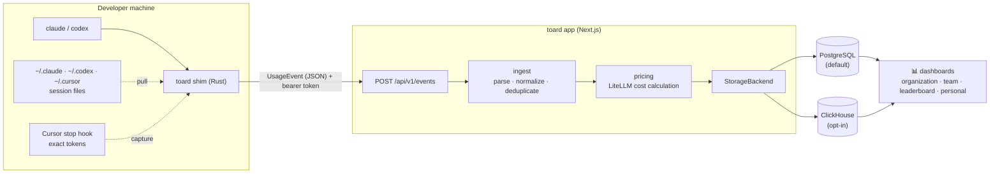

<div align="center">

<picture>
  <source media="(prefers-color-scheme: dark)" srcset="docs/brand/logo-dark.svg">
  
</picture>

# toard

**AI coding-tool usage and cost in one place** — open source · self-hosted · multi-provider

*Track AI coding-tool usage and cost across your organization — Claude Code, Codex, and beyond.*

[](https://github.com/devy1540/toard/actions/workflows/ci.yml)
[](https://github.com/devy1540/toard/actions/workflows/shim-ci.yml)
[](LICENSE)


[](CONTRIBUTING.md)

[Quick start](#-quick-start) · [Deploying to a team](#-deploying-to-a-team) · [How it works](#-how-it-works) · [Utilization policy](docs/ai-utilization-policy.md) · [Architecture](docs/ARCHITECTURE.md) · [Deployment guide](docs/DEPLOY.md) · [Contributing](CONTRIBUTING.md)

</div>

---

## ✨ Features

- **🔌 Multi-provider** — bring Claude Code, Codex, Cursor, Gemini, Qwen, and other tools into one dashboard
- **🪶 Lightweight collection** — the shim collects usage and AI-tool activity from local session files and Cursor's minimal token hook; devices are identified automatically, idempotent deduplication is built in, and experimental OTLP push ingestion is also available
- **🧰 AI-tool visibility** — inspect MCP and skill activity, plus plugin, skill, and MCP installation status by device, using metadata only
- **🧭 AI utilization index** — personal dashboards provide a three-axis score relative to the individual; organization dashboards expose only anonymized aggregates for groups of at least five people ([policy](docs/ai-utilization-policy.md) · [methodology](docs/ai-utilization-methodology.md))
- **💰 Accurate cost calculation** — a LiteLLM-price-based engine supports per-million, tiered 200k, cache, and fast-mode pricing with daily automatic synchronization
- **👥 Organization views** — organization and team aggregates, leaderboards, personal dashboards, an admin panel, and invitation-based self-onboarding
- **🗄️ Scalable storage** — PostgreSQL is the default single backend; ClickHouse is an opt-in option for medium and larger installations through the `StorageBackend` abstraction
- **🔐 Flexible authentication** — choose OAuth with GitHub or Google, credentials, or open mode to fit your environment
- **🏠 Self-hosted** — start with one Docker Compose command and scale to zero-downtime Kubernetes or Helm deployments
- **🌏 Time-zone aware** — screens use the viewer's browser time zone, or their explicit user setting, so “today” is correct wherever they are; `ORG_TIMEZONE` uses an IANA identifier as the aggregation cutoff and fallback

## 🧭 How it works

The shim transparently wraps `claude` and `codex` on each developer machine. It collects usage, opt-in conversation content, and AI-tool activity metadata from local session files under `~/.claude`, `~/.codex`, and `~/.cursor`, plus exact token counts from Cursor's minimal stop hook. Toad presents the resulting cost, activity, and installation status in its dashboards. OTLP push ingestion is experimental.



## 🚀 Quick start

The fastest way to try toard is the all-in-one Docker Compose stack with the app, PostgreSQL, and migrations. It pulls prebuilt images from GHCR and starts immediately:

```bash
AUTH_SECRET=$(openssl rand -base64 33) docker compose up -d   # → http://localhost:3000
```

Startup fails immediately if `AUTH_SECRET` is missing; there is no insecure default. Published images support both amd64 and arm64. Add `--build` to build from source, or set `TOARD_TAG=v…` to pin a version. For a real team rollout, see [Deploying to a team](#-deploying-to-a-team).

### 🤖 Install with an AI agent

Ask an AI agent such as Claude Code to install and verify toard. The agent follows the runbook in [AGENTS.md](AGENTS.md), including non-interactive installation, success criteria, and failure handling:

> Follow AGENTS.md in https://github.com/devy1540/toard to install and verify toard.
> Use me@corp.com as the administrator email; I will enter the password myself.

### Local development

```bash
pnpm install
cp .env.example .env          # Fill in AUTH_SECRET and BOOTSTRAP_ADMIN_EMAIL
pnpm db:up                    # Local PostgreSQL in Docker
pnpm migrate                  # Apply the schema
pnpm seed                     # Providers, admin, and a dev ingest token printed once
pnpm dev                      # http://localhost:3000
```

To inspect the dashboard layout with realistic data, seed synthetic usage into the local database. The command runs by default only against `localhost` or `127.0.0.1` databases. New content history uses server-managed `managed_v1` encryption: the server wraps user keys with the KMS, Transit provider, or local KEK selected for the installation. New E2EE setup and activation have been retired; only recovery and migration paths for existing `e2ee_v1` users remain while legacy ciphertext exists. Follow the [server-managed content encryption runbook](docs/content-encryption-runbook.md) for provider setup, cost, rotation, and recovery. `TOARD_CONTENT_KEK_B64` is required only for legacy `server_v1` content and cannot decrypt managed or E2EE content.

Before retiring the server KEK after a complete `server_v1` migration, set `TOARD_LEGACY_BACKUP_RETENTION_DAYS` to match the real backup policy. Admin → System reports, in order, that no legacy rows remain, the backup retention period has elapsed, an administrator has confirmed retirement, and the KEK has been removed. If legacy rows remain while the KEK is missing, `/api/ready` returns 503 and blocks deployment.

```bash
pnpm seed:dashboard-demo --dry-run
pnpm seed:dashboard-demo
# To view immediately in open mode:
AUTH_OPEN_USER_EMAIL=demo.viewer@toard.local pnpm dev
```

### Verification

```bash
pnpm typecheck     # All packages
pnpm test          # Pricing unit tests, including resolveCost
```

## 🏢 Deploying to a team

toard consists of **one server plus a shim on each developer machine**. Collection is pushed from developers to the server, so the server never needs to connect to developer machines. The machines may be on different networks as long as **outbound HTTPS from each developer to the server** is available.

1. **Deploy the server** — run the Compose stack from [Quick start](#-quick-start) at an address reachable by developers, such as an internal DNS name or IP. Create the administrator at `/setup` on first access. See the [deployment guide](docs/DEPLOY.md) for Kubernetes, Helm, and other options.
2. **Share the link** — the administrator only needs to share the toard URL with the team.
3. **Self-onboard** — each developer signs in, opens **Settings → Install & Token**, issues a token, runs the one-line installer, and selects **Check connection** to verify ingestion immediately. Usage is attributed to that person's account. See [Install the shim](#-install-the-shim-usage-collection).

The token is sent as a bearer token, so TLS is recommended on public networks. Set `TOARD_PUBLIC_URL` only when the browser URL and ingestion URL differ behind a proxy; otherwise toard infers the public URL from the request host.

## 📁 Repository structure (pnpm monorepo)

```text
apps/web                    # Next.js: OTLP/JSON ingestion, dashboards, and Auth.js
packages/core               # Domain types and StorageBackend interface, with no dependencies
packages/ingest             # OTLP parsing, provider detection, normalization, and deduplication
packages/pricing            # LiteLLM cost engine (resolveCost)
packages/storage-postgres   # Default PostgreSQL StorageBackend implementation
packages/storage-clickhouse # Opt-in ClickHouse StorageBackend implementation
shim/                       # Rust CLI wrapper shim and install/uninstall scripts
migrations/                 # Plain SQL migrations managed by node-pg-migrate
clickhouse/init/            # ClickHouse schema loaded on first container startup
scripts/                    # Seed, sample-event, and verification scripts
docs/                       # Architecture and deployment documentation
```

## 📡 Test ingestion without the shim

```bash
TOARD_INGEST_TOKEN=<token from seed or Settings → Install & Token> pnpm exec tsx scripts/send-sample-event.ts
# → 200 {"inserted":1,"deduped":0}; the event uses the current time and appears under “today”
```

To inspect the raw OTLP payload and idempotent deduplication, send the fixture directly:

```bash
curl -X POST http://localhost:3000/api/v1/logs \
  -H "Authorization: Bearer <token>" \
  -H "Content-Type: application/json" \
  --data @fixtures/sample-otlp-logs.json
# → {"inserted":1,"deduped":0}; rerunning returns deduped:1
# The fixture has a fixed historical timestamp, so it is ingested but does not appear in the default “today” range.
```

## 🔗 Install the shim (usage collection)

The shim wraps `claude` and `codex` on each developer machine and sends usage and AI-tool activity to toard, with automatic OS and architecture detection. Install only one shim and one scheduled collection job per user account. That installation can send independently to **any number of toard server targets**, such as work and personal servers. By default, tool collection handles only metadata such as MCP, skill, and plugin names, timestamps, and status. It **never sends tool arguments, outputs, commands, environment variables, absolute paths, or raw payloads**. See [AI tool metadata collection](docs/tool-metadata-collection.md) for fields, detection limits, and opt-out instructions.

**One-line installer (recommended)** — after signing in, open **Settings → Connect a computer**, confirm the operating system, and copy the provided command. A token for that computer is issued automatically, and the page verifies the first authenticated request after installation. Running a command from a new server adds that target without removing existing targets. Rerunning a command for the same server updates only that target's token and policy while preserving its delivery cursor. Legacy single-server installations migrate automatically to the target structure on the first new-version installation. Claude, Codex, Gemini, and Qwen backfill historical usage from local session files. Cursor usage starts after the exact-token stop hook is installed, while existing `.cursor` transcripts are used for opt-in conversation content and MCP or skill activity.

```bash
curl -fsSL <toard URL>/install.sh | TOARD_INGEST_TOKEN=<my token> sh
```

On Windows x64, the same page provides a PowerShell command:

```powershell
$env:TOARD_INGEST_TOKEN='<my token>'; irm '<toard URL>/install.ps1' | iex
```

**Manual configuration (advanced)** — `toard-shim targets list` shows targets, policies, and recent delivery status without exposing tokens. `toard-shim doctor` diagnoses all targets. Credentials and cursors are isolated per server under `~/.toard/targets/<sha256(endpoint)>/{credentials,state}`. If one server is temporarily unavailable, other targets continue receiving events, and the failed target retries only its own undelivered range on the next run. There is no separate durable outbox, so deleting the original local session logs during an outage makes missing events for that target unrecoverable. A `v*` tag push triggers GitHub Actions to publish binaries for macOS and Linux arm64/x64 and Windows x64. The Windows installer downloads the GitHub Release binary directly, verifies its SHA256 checksum, and registers scheduled collection in Task Scheduler.

**Uninstall** — on macOS and Linux, run `curl -fsSL <toard>/uninstall.sh | sh`. On Windows, run `irm '<toard>/uninstall.ps1' | iex`. The uninstall command from each server removes only that server target. If other targets remain, the shim, scheduled collection, and PATH entry remain installed. Shared installation files are removed only when the final target is deleted. An uninstall command from an unregistered server is a no-op, and existing Claude/Codex installations and original session logs are always preserved.

## 🧊 ClickHouse mode (opt-in)

For medium and larger installations, store events and aggregates in ClickHouse while metadata and authentication always remain in PostgreSQL, as defined by ADR-003.

```bash
pnpm db:up                              # Start PostgreSQL and ClickHouse
STORAGE_BACKEND=clickhouse pnpm dev     # Use the ClickHouse backend
```

Default connection values are `CLICKHOUSE_URL=http://localhost:8123` and `CLICKHOUSE_USER/PASSWORD/DB=toard`. The schema under `clickhouse/init/` is loaded automatically when the container starts for the first time. Run `pnpm exec tsx scripts/verify-clickhouse.ts` for smoke verification.

Multi-resolution rollups operate their workers and read paths independently. On the ClickHouse backend, the **15-minute base rollup** and the **time-zone-specific hourly and daily rollup** workers are enabled by default. A compactor is hard-disabled only when its value is explicitly set to `0`, `false`, or `off`. When read environment variables are unset, toard backfills and verifies data through a fixed historical target `T0`, accumulates 60 minutes of healthy operation, and then switches reads automatically. Only the 97-day TTL for normalized `usage_events` is disabled by default and never enables itself automatically.

| Environment variable | Purpose |
|---|---|
| `CLICKHOUSE_15M_V2_COMPACTOR` | Enabled by default. Builds the 15-minute base rollup while preserving pricing revision and status; `0`, `false`, and `off` hard-disable it. |
| `CLICKHOUSE_READ_15M_V2_ROLLUP` | Automatic when unset. `1` is an emergency force-on override and `0` is an emergency force-off override. Unready ranges fall back to fine-grained raw data. |
| `CLICKHOUSE_TIMEZONE_ROLLUP_COMPACTOR` | Enabled by default. Builds hourly and daily rollups for active IANA time zones; `0`, `false`, and `off` hard-disable it. |
| `CLICKHOUSE_READ_TIMEZONE_ROLLUP` | Automatic when unset. `1` is an emergency force-on override and `0` is an emergency force-off override. Incomplete ranges fall back to the 15-minute base rollup. |
| `CLICKHOUSE_ENFORCE_RETENTION_TTL` | Disabled by default. After explicit approval, independently of automatic read switching, applies a 90-day logical correction window plus a 7-day safety grace period, for a physical 97-day TTL, to normalized `usage_events`. |
| `CLICKHOUSE_READ_ROLLUP` | **Deprecated alias.** It never reads the legacy `usage_hourly_rollup` and only forces time-zone rollup reads when the new flags are absent. Unset it after migration. |

The cutover sequence is **deploy schema → automatic worker backfill → fix T0 → verify raw and rollup consistency → observe 60 healthy minutes → switch automatically to the 15-minute base rollup → switch automatically to hourly and daily time-zone rollups**. `T0` is fixed once at the 15-minute boundary obtained by subtracting the finalize delay from the current time. Real-time workers handle new data and users after T0 separately, so they do not postpone cutover or reset the observation window. Late data before T0 pauses and then resumes observation only while the affected bucket is recomputed.

At startup, the app canonicalizes and capability-checks `ORG_TIMEZONE` and distinct `users.timezone` values against ClickHouse and registers them asynchronously. It prewarms only new or coverage-missing buckets: the most recent 400 local days for daily rollups and 32 local days for hourly rollups, in 16-bucket chunks. Registering a new time zone after the global cutover never rolls existing time zones back. Only the new time zone uses the exact 15-minute path until its backfill and representative hour/day verification finish and `validated_at` is recorded. Normal queries prefer the rollup matching the requested resolution and fall back automatically to the 15-minute base rollup or fine-grained raw data when coverage is absent or recomputation is required.

Administrators can inspect the automatic cutover stage, fixed T0, accumulated 60-minute observation window, actual query source, coordinator heartbeat and latest work, worker progress and ETA, adaptive batch ceiling, automatic throttling state, and storage size under **Admin → System → Rollup operations** (`/admin?tab=system`). While visible, the screen calls `GET /api/admin/rollups/status` every 10 seconds. Pause and resume use the administrator-only `POST /api/admin/rollups/control` endpoint and persist across app restarts. A worker increases throughput when its latest batch finished within two seconds and used the full limit; it halves the batch size after a failure or when a batch takes at least 10 seconds.

One coordinator holds a global load slot across all replicas and runs only one heavy operation at a time: a 15-minute base rollup task, a time-zone rollup task, or a consistency verification. It schedules the next run 10 seconds after each completion, while each worker maintains a minimum 60-second interval. Workers that have been runnable for more than 120 seconds receive priority to prevent starvation. A time-zone task is runnable only when the 15-minute watermark has reached its `source_to` and there are no dirty buckets. Until then, the UI reports `waiting for 15-minute base` rather than an error or stall. Late data arriving during processing changes the job generation, so an outdated result is not accepted as complete and the new generation is processed again. The new-ingestion outbox continues delivering outside this load slot.

For an existing installation with `CLICKHOUSE_READ_ROLLUP=1`, deploy the schema first, then set `CLICKHOUSE_READ_TIMEZONE_ROLLUP=0` to block the legacy alias while validating migrations and worker status. Unset both `CLICKHOUSE_READ_ROLLUP` and the new read override afterward to return to automatic cutover. A remaining legacy value emits one deprecation warning per process and sets `rollups.legacyFlagMigration` in `/api/ready` to `deprecated_alias`.

The ingestion API's late-event cutoff and dashboard queries continue to use a logical 90-day boundary. The physical raw TTL and delivered outbox/batch retention are 97 days, leaving seven days for an event accepted exactly at the 90-day boundary to pass through outbox flushing and the v2 compactor. The normalized `usage_events` TTL is never applied by initialization or runtime before the opt-in flag above is enabled. Separately, the schema automatically applies a 7-day TTL to auxiliary ClickHouse `raw_events` and a 400-day TTL to the legacy hourly, 15-minute v2, and time-zone caches. In production non-Vercel deployments, the app runs daily cleanup for PostgreSQL `raw_events` after seven days, completed time-zone jobs after seven days, outbox and batch rows after 97 days, hourly time-zone coverage after 32 local days, and daily coverage after 400 local days. PostgreSQL raw cleanup atomically detaches references and deletes up to 1,000 rows per transaction. It continues with another raw-only batch after one second when a batch is full and stops after a short batch. Errors back off for 60 seconds, and drains never overlap within the same process.

The exact verifier changes TTLs and inserts fixtures, so never run it against an existing localhost service. Follow the [ClickHouse Exact Rollup Runbook](docs/clickhouse-exact-rollup-runbook.md#92-shadow와-성능-gate) to create and remove its dedicated tmpfs PostgreSQL and ClickHouse services. The HTTP release gate creates and cleans up its own isolated Compose project.

```bash
pnpm benchmark:dashboard-http
```

The release performance gate starts real app, PostgreSQL, and ClickHouse containers in a dedicated Compose profile. It confirms a total limit of 4 vCPU and 8 GiB through Docker inspect, then measures authenticated production Next.js HTTP responses from inside the app container. A fixed 400-day, one-million-event fixture passes through raw ingestion, the 15-minute v2 compactor, time-zone activation and workers, and durable coverage in an isolated tmpfs stack. It measures eight organization, provider, team, and personal scenarios across five time zones 100 times each. Only when every scenario meets P50 ≤ 1 second and P95 ≤ 2 seconds does it print `RELEASE_PASS`. Each request clears ClickHouse query, uncompressed, and mark caches and uses a unique URL to bypass the app response cache. It never uses `AUTH_MODE=open`.

`pnpm benchmark:dashboard-http:diagnostic` measures host-localhost performance and is not evidence for a release pass. `pnpm benchmark:rollup:micro` diagnoses individual ClickHouse SQL statements only. The sole release command is `pnpm benchmark:dashboard-http`, and it fails before fixture generation unless the app has 1.5 vCPU/2 GiB, PostgreSQL has 1 vCPU/2 GiB, and ClickHouse has 1.5 vCPU/4 GiB.

The release wrapper cleans up its dedicated Compose project exactly once on success, failure, or interruption. A cleanup failure prevents a successful exit; when both the benchmark and cleanup fail, it reports both errors. `SIGINT` and `SIGTERM` are forwarded to the running child process, and the wrapper waits for cleanup before exiting with 130 or 143. Run `pnpm test:benchmark-dashboard-signal` to verify signal-cleanup behavior.

If automated verification finds a real data mismatch once, reads immediately fall back to the exact path. Transient connection or latency errors trigger fallback after three consecutive failures. For an additional emergency stop, set the relevant `CLICKHOUSE_READ_*` variable to `0` and recreate only the app. After fixing the problem, unset the override to repeat cutover with a new T0 and a new 60-minute observation window. Do not touch the database or ClickHouse containers or the rollup tables. TTL activation is separate from read cutover, and raw data already removed by TTL cannot be restored by rolling reads back.

```bash
docker compose up -d --no-deps --force-recreate app
```

See the [ClickHouse Exact Rollup Runbook](docs/clickhouse-exact-rollup-runbook.md) for verification SQL, interpretation of `healthy`, `fallback`, and `disabled` in `/api/ready`, and step-by-step rollback procedures.

## 🔐 Authentication (login modes)

Select the mode appropriate for the organization with `AUTH_MODE`. Authentication uses JWT sessions as defined by ADR-007, and the login page is available at `/login`.

| Mode | Behavior | Intended use |
|---|---|---|
| `oauth` (default) | GitHub/Google OAuth plus credentials-based sign-in and registration | Public or organization deployments |
| `open` | Access without authentication as the first or configured user; **the dashboard is public** | Trusted internal networks or single-organization deployments |

OAuth and credentials can be enabled together, and both appear on `/login`. Email magic links are planned.

**Credentials** — enabled by default. Registration is available at `/signup` with optional domain gating, and passwords can be set or changed at `/settings`:

```bash
AUTH_CREDENTIALS_ENABLED=true               # Set false for OAuth only
ALLOWED_EMAIL_DOMAINS=example.com           # Optional registration allowlist
BOOTSTRAP_ADMIN_PASSWORD=...                # Optional: seed stores an admin password hash
```

Passwords are stored only as bcrypt hashes with cost 12. Registration with the email address of an existing OAuth account is rejected to prevent account takeover; set a password from `/settings` instead.

**OAuth** — only providers with configured credentials are enabled. Development without a configured provider falls back to the first user:

```bash
AUTH_SECRET=...                             # openssl rand -base64 33
AUTH_GITHUB_ID=...  AUTH_GITHUB_SECRET=...  # GitHub OAuth App
AUTH_GOOGLE_ID=...  AUTH_GOOGLE_SECRET=...  # Optional Google OAuth client
```

Callback URL: `http://localhost:3000/api/auth/callback/{github|google}`.

**Open mode** — because the dashboard is available without authentication, use this mode **only on a trusted internal network**:

```bash
AUTH_MODE=open
AUTH_OPEN_USER_EMAIL=admin@example.com      # Optional; defaults to the first user
```

Ingest tokens are always required regardless of authentication mode.

## ⏰ Scheduler (cron)

`sync-pricing`, the daily LiteLLM price synchronization, requires **no separate scheduler on self-hosted deployments**. On startup, the app registers an internal scheduler that runs once per day according to the organization time zone across Compose, Kubernetes, Helm, and bare deployments. After synchronization, it automatically recalculates unresolved pricing within the retention window and refreshes both PostgreSQL and ClickHouse rollups.

When a historical log from the most recent 90 days arrives late and no pricing revision exists for its usage date, toard checks the public LiteLLM Git history in the background. It promotes only prices supported across the complete interval, recalculates costs, and automatically rebuilds 15-minute, hourly, and daily rollups. GitHub outages or rate limits never block ingestion or reads; recovery resumes from the stored cursor and backoff time. Because the process does not hard-code a particular model or month, it applies equally to other historical months and new models.

No administrator action is required. Use `PRICING_AUTO_SYNC=off` only as an infrastructure emergency kill switch. When using an external scheduler:

- **Vercel** — the crons in `vercel.json` run automatically, and the internal scheduler disables itself on Vercel. When `CRON_SECRET` is configured, Vercel automatically sends it as an `Authorization: Bearer` header.
- **GitHub Actions** — `.github/workflows/cron.yml` calls the endpoint with `secrets.APP_URL` and `secrets.CRON_SECRET`. Use this option when an exact schedule such as 18:00 UTC is required, and set `PRICING_AUTO_SYNC=off` to prevent duplicate runs.

Without `CRON_SECRET`, `/api/cron/*` endpoints are publicly accessible, so **always configure it in production**. Register `recompute` only when serving from the mart; it is unnecessary for the current event-direct path described in section 4.4.

The Admin → System tab shows the model count, last synchronization, and automatic recovery progress as read-only status. Models not yet present in the price table are checked automatically during the next daily synchronization, and dashboards label pre-resolution cost as a partial total.

Run `pnpm verify:historical-pricing` to validate historical price changes, restart cursors, cost correction, raw-data immutability, and rollup invalidation together in isolated temporary PostgreSQL and ClickHouse services. The command creates only test containers and removes them on exit.

## 🚢 Deployment (Docker · Kubernetes · Helm)

toard provides container deployment artifacts. See [docs/DEPLOY.md](docs/DEPLOY.md) for complete instructions and options.

- **Docker** — a multi-target `Dockerfile` for runner and migrator images, plus `docker-compose.yml` with ClickHouse and seed profiles
- **Kubernetes** — `k8s/` with Kustomize, zero-downtime rolling updates, probes, preStop draining, and migrations in an app initContainer
- **Helm** — `helm/toard` values for images, secrets, bundled or external databases, and Ingress tuning
- **Health endpoints** — `/api/health` for liveness and `/api/ready` for readiness with a database ping

## 🧠 Key decisions

| Area | Decision | ADR |
|---|---|---|
| Ingestion | Shim sends OTLP/JSON directly to the app without a Collector; zero-downtime deployment is required | ADR-001 |
| Storage | PostgreSQL only by default, with opt-in ClickHouse behind the `StorageBackend` abstraction | ADR-003 |
| Cost | LiteLLM per-million, tiered 200k, cache, and fast-mode pricing | ADR-004 |
| Authentication | Auth.js with OAuth, credentials, and open modes using JWT sessions | ADR-007 |
| Time zones | Display in the viewer's browser or configured user time zone; use `ORG_TIMEZONE`, an IANA identifier defaulting to UTC, for mart cutoffs and fallback | ADR-008 |

See section 2, ADRs, in the [architecture documentation](docs/ARCHITECTURE.md) for rationale and review history.

## 🤝 Contributing and security

Contributions are always welcome. See [CONTRIBUTING.md](CONTRIBUTING.md) for the contribution guide and [SECURITY.md](SECURITY.md) to report vulnerabilities through a private advisory.

## 📄 License

[MIT](LICENSE)
