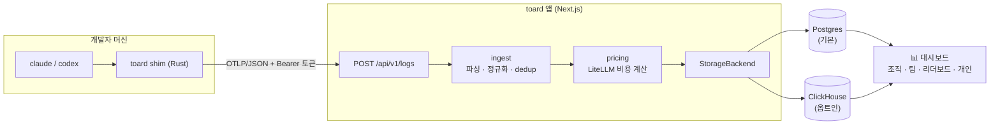

<div align="center">

<picture>
  <source media="(prefers-color-scheme: dark)" srcset="docs/brand/logo-dark.svg">
  
</picture>

# toard

**여러 AI 코딩 도구의 사용량·비용을 한곳에서** — 오픈소스 · 셀프호스팅 · 멀티 프로바이더

*Track AI coding-tool usage & cost across your org — Claude Code, Codex, and beyond.*

[](https://github.com/devy1540/toard/actions/workflows/ci.yml)
[](https://github.com/devy1540/toard/actions/workflows/shim-ci.yml)
[](LICENSE)


[](CONTRIBUTING.md)

[빠른 시작](#-빠른-시작) · [동작 방식](#-동작-방식) · [설계 문서](docs/ARCHITECTURE.md) · [배포 가이드](docs/DEPLOY.md) · [기여하기](CONTRIBUTING.md)

</div>

---

## ✨ 특징

- **🔌 멀티 프로바이더** — Claude Code · Codex 등 OTLP를 내보내는 도구를 하나의 대시보드로 수렴
- **🪶 경량 수집** — Collector·별도 파이프라인 없이 앱이 OTLP/JSON을 직접 수신 (멱등 dedup 내장)
- **💰 정확한 비용** — LiteLLM 가격 기반 비용 엔진: per-million + tiered(200k) + 캐시/fast 요금, 일 단위 자동 동기화
- **👥 조직 뷰** — 조직/팀 집계 · 리더보드 · 개인 대시보드 · 관리자 패널 · 초대 기반 셀프 온보딩
- **🗄️ 확장 가능한 저장소** — 기본은 Postgres 단일, 중규모 이상은 ClickHouse 옵트인 (`StorageBackend` 추상화)
- **🔐 유연한 인증** — OAuth(GitHub/Google) · id/pw · open 모드를 조직 환경에 맞게 선택
- **🏠 셀프호스팅** — Docker Compose 한 줄부터 Kubernetes/Helm 무중단 배포까지
- **🌏 타임존 지원** — `ORG_TIMEZONE`(IANA) 기준 일별 집계 — 어느 조직 시간대든 "하루"가 정확

## 🧭 동작 방식

개발자 머신의 shim이 `claude`/`codex`를 투명하게 래핑해 사용량을 OTLP로 전송하고, toard가 이를 정규화·비용 계산해 대시보드로 보여준다.



## 🚀 빠른 시작

가장 빠른 체험은 올인원 Docker Compose(app + Postgres + 마이그레이션):

```bash
AUTH_SECRET=$(openssl rand -base64 33) docker compose up -d --build   # → http://localhost:3000
```

### 로컬 개발

```bash
pnpm install
cp .env.example .env          # AUTH_SECRET, BOOTSTRAP_ADMIN_EMAIL 채우기
pnpm db:up                    # 로컬 Postgres (docker)
pnpm migrate                  # 스키마
pnpm seed                     # providers + admin + dev ingest token (평문 1회 출력)
pnpm dev                      # http://localhost:3000
```

### 검증

```bash
pnpm typecheck     # 전 패키지
pnpm test          # pricing 단위 테스트 (resolveCost)
```

## 📁 구조 (pnpm 모노레포)

```
apps/web                    # Next.js — OTLP/JSON 수신 + 대시보드 + Auth.js
packages/core               # 도메인 타입 + StorageBackend 인터페이스 (의존성 0)
packages/ingest             # OTLP 파싱 · provider 식별 · 정규화 · dedup
packages/pricing            # LiteLLM 비용 엔진 (resolveCost)
packages/storage-postgres   # StorageBackend PG 구현 (기본)
packages/storage-clickhouse # StorageBackend CH 구현 (옵트인)
shim/                       # CLI 래퍼 shim (Rust) + install/uninstall 스크립트
migrations/                 # 순수 SQL (node-pg-migrate)
clickhouse/init/            # ClickHouse 스키마 (컨테이너 최초 기동 시 자동 로드)
scripts/                    # seed · 샘플 이벤트 전송 · 검증 스크립트
docs/                       # ARCHITECTURE.md · DEPLOY.md
```

## 📡 수집 테스트 (shim 없이)

```bash
TOARD_INGEST_TOKEN=<seed 또는 설정→설치 탭에서 발급한 토큰> pnpm exec tsx scripts/send-sample-event.ts
# → 200 {"inserted":1,"deduped":0} — 현재 시각으로 전송되어 대시보드 "최근 30일"에 바로 보임
```

원시 OTLP 페이로드·멱등(dedup) 확인은 픽스처를 그대로 전송:

```bash
curl -X POST http://localhost:3000/api/v1/logs \
  -H "Authorization: Bearer <토큰>" \
  -H "Content-Type: application/json" \
  --data @fixtures/sample-otlp-logs.json
# → {"inserted":1,"deduped":0}  (재실행 시 deduped:1 — 멱등)
# 픽스처 타임스탬프는 과거 고정이라 수집은 되지만 대시보드 기본 기간(최근 30일)에는 표시되지 않음
```

## 🔗 shim 설치 (사용량 수집)

개발자 머신에서 `claude`/`codex` 를 래핑해 사용량을 toard 로 전송(OS/arch 자동 감지). **프롬프트·코드 내용은 수집하지 않는다** — 토큰 수·모델·비용 등 사용량 메타데이터만 전송된다. 설치 후에는 **설정 → 설치 · 토큰 탭의 "연결 확인"** 으로 실제 수신 여부를 즉시 점검할 수 있다.

**사용자(권장)** — 로그인 후 **설정 → 설치 · 토큰 탭**에서 본인 토큰 + 설치 스니펫을 복사한다. 관리자는 toard 링크만 공유하면 각 사용자가 자기 토큰으로 셀프 온보딩한다(사용량이 본인 계정에 귀속).

**수동**:

```bash
curl -fsSL https://github.com/devy1540/toard/releases/latest/download/install.sh | sh
```

설치 후 `~/.toard/bin` 을 PATH 앞(진짜 claude 보다)에 두고, `~/.toard/credentials` 에 `agent_key`(개인 ingest 토큰)·`endpoint`(`<toard>/api`) 설정. `v*` 태그 push → GitHub Actions 가 4-플랫폼 빌드 후 Release 게시(`npx @toard/shim` 은 npm 게시 후 제공 예정).

**제거** — `curl -fsSL <toard>/uninstall.sh | sh` (shim·자격증명·PATH·codex `[otel]` 블록을 백업 남기고 되돌림. 진짜 claude/codex 는 그대로).

## 🧊 ClickHouse 모드 (옵트인)

중규모 이상에서 이벤트·집계만 ClickHouse 로 (메타·인증은 항상 PG, ADR-003).

```bash
pnpm db:up                              # postgres + clickhouse 함께 기동
STORAGE_BACKEND=clickhouse pnpm dev     # 앱이 CH 백엔드 사용
```

기본 접속값: `CLICKHOUSE_URL=http://localhost:8123` · `CLICKHOUSE_USER/PASSWORD/DB=toard`. 스키마는 `clickhouse/init/` 가 컨테이너 최초 기동 시 자동 로드. 스모크 검증: `pnpm exec tsx scripts/verify-clickhouse.ts`.

## 🔐 로그인 (인증 모드)

`AUTH_MODE` 로 조직 환경에 맞게 선택한다(ADR-007, JWT 세션). 로그인 페이지는 `/login`.

| 모드 | 동작 | 용도 |
|---|---|---|
| `oauth` (기본) | GitHub/Google OAuth + **id/pw** 로그인·가입 | 외부·조직 |
| `open` | 인증 없이 접근(첫/지정 user) — **대시보드 공개** | 내부망·단일 조직 |

OAuth 와 id/pw 는 함께 켤 수 있다(둘 다 `/login` 에 노출). 이메일 매직링크는 확장 예정.

**id/pw (credentials)** — 기본 활성. 가입은 `/signup`(도메인 게이팅), 비번 변경/설정은 `/settings`:

```bash
AUTH_CREDENTIALS_ENABLED=true               # false 로 OAuth 전용
ALLOWED_EMAIL_DOMAINS=example.com           # (선택) 가입 허용 도메인
BOOTSTRAP_ADMIN_PASSWORD=...                # (선택) seed 가 admin 비번 해시 저장 → 최초 로그인
```

비번은 bcrypt(cost 12) 해시로만 저장. 기존 OAuth 계정 이메일로는 가입 불가(계정 탈취 방지) — 대신 `/settings` 에서 비번 설정.

**oauth** — 자격이 있는 provider 만 활성화(미설정 dev 는 첫 user 폴백):

```bash
AUTH_SECRET=...                             # openssl rand -base64 33
AUTH_GITHUB_ID=...  AUTH_GITHUB_SECRET=...  # GitHub OAuth App
AUTH_GOOGLE_ID=...  AUTH_GOOGLE_SECRET=...  # Google OAuth Client (선택)
```

콜백 URL: `http://localhost:3000/api/auth/callback/{github|google}`.

**open** — 대시보드가 인증 없이 열리므로 **신뢰된 내부망에서만**:

```bash
AUTH_MODE=open
AUTH_OPEN_USER_EMAIL=admin@example.com      # (선택) 귀속할 user, 미지정 시 첫 user
```

수집 ingest 토큰은 모드와 무관하게 항상 필요(수집 보안 유지).

## ⏰ 스케줄러 (cron)

`sync-pricing`(LiteLLM 가격 일 동기화)을 배포 플랫폼에 등록한다. 두 경로 중 하나:

- **Vercel**: `vercel.json` 의 `crons` 가 자동 실행 — `CRON_SECRET` env 설정 시 Vercel 이 `Authorization: Bearer` 를 자동 첨부.
- **그 외/self-host**: `.github/workflows/cron.yml` 이 `secrets.APP_URL`·`secrets.CRON_SECRET` 로 엔드포인트를 호출(둘 중 하나만 활성화).

`CRON_SECRET` 미설정 시 엔드포인트가 인증 없이 열리므로 **프로덕션에선 반드시 설정**. `recompute` 는 Mart 를 서빙에 쓸 때만 등록(현재 event-direct 라 불필요 — §4.4).

cron 등록 전이거나 실패했다면 **관리 → 시스템 탭에서 수동 동기화**할 수 있다(모델 수·마지막 동기화 시각 표시). 가격이 비어 있으면 비용이 $0 으로 계산되므로 대시보드에 경고가 표시된다.

## 🚢 배포 (Docker · Kubernetes · Helm)

컨테이너 배포 산출물 제공 — 상세·옵션은 [docs/DEPLOY.md](docs/DEPLOY.md).

- **Docker**: 멀티타깃 `Dockerfile`(runner·migrator) + `docker-compose.yml`(ClickHouse·seed 프로파일)
- **Kubernetes**: `k8s/`(kustomize) — 무중단 롤링 + 프로브 + preStop 드레인, 마이그레이션은 앱 initContainer
- **Helm**: `helm/toard` — values 로 이미지·시크릿·번들/외부 DB·Ingress 튜닝
- 헬스: `/api/health`(liveness) · `/api/ready`(readiness, DB ping)

## 🧠 핵심 결정

| 영역 | 결정 | ADR |
|---|---|---|
| 수집 | shim → 앱이 OTLP/JSON 직접 수신(Collector 없음) · 무중단 배포 필수 | ADR-001 |
| 저장 | Postgres 단일(기본) · ClickHouse 옵트인 — `StorageBackend` 추상화 | ADR-003 |
| 비용 | LiteLLM per-million + tiered(200k) + 캐시/fast | ADR-004 |
| 인증 | Auth.js — OAuth·id/pw·open 모드, JWT 세션 | ADR-007 |
| 타임존 | 일별 집계 "하루" 경계 = `ORG_TIMEZONE`(IANA, 기본 UTC) | ADR-008 |

자세한 근거·검토 이력은 [설계 문서](docs/ARCHITECTURE.md) §2(ADR) 참조.

## 🤝 기여 · 보안

기여는 언제나 환영! 가이드는 [CONTRIBUTING.md](CONTRIBUTING.md), 취약점 신고는 [SECURITY.md](SECURITY.md)(비공개 advisory)를 참고.

## 📄 라이선스

[MIT](LICENSE)
