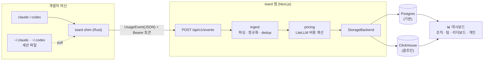

<div align="center">

<picture>
  <source media="(prefers-color-scheme: dark)" srcset="docs/brand/logo-dark.svg">
  
</picture>

# toard

**여러 AI 코딩 도구의 사용량·비용을 한곳에서** — 오픈소스 · 셀프호스팅 · 멀티 프로바이더

*Track AI coding-tool usage & cost across your org — Claude Code, Codex, and beyond.*

[](https://github.com/devy1540/toard/actions/workflows/ci.yml)
[](https://github.com/devy1540/toard/actions/workflows/shim-ci.yml)
[](LICENSE)


[](CONTRIBUTING.md)

[빠른 시작](#-빠른-시작) · [팀에 배포하기](#-팀에-배포하기) · [동작 방식](#-동작-방식) · [설계 문서](docs/ARCHITECTURE.md) · [배포 가이드](docs/DEPLOY.md) · [기여하기](CONTRIBUTING.md)

</div>

---

## ✨ 특징

- **🔌 멀티 프로바이더** — Claude Code · Codex · Gemini · Qwen 등을 하나의 대시보드로 수렴
- **🪶 경량 수집** — shim 이 로컬 세션 파일에서 사용량과 AI 도구 활동을 pull 수집(재시작·env 설정 불필요, 기기별 구분 자동) · 멱등 dedup 내장 · OTLP push 도 experimental 로 지원
- **🧰 AI 도구 가시성** — MCP·스킬 활동과 기기별 플러그인·스킬·MCP 설치 현황을 메타데이터만으로 확인
- **💰 정확한 비용** — LiteLLM 가격 기반 비용 엔진: per-million + tiered(200k) + 캐시/fast 요금, 일 단위 자동 동기화
- **👥 조직 뷰** — 조직/팀 집계 · 리더보드 · 개인 대시보드 · 관리자 패널 · 초대 기반 셀프 온보딩
- **🗄️ 확장 가능한 저장소** — 기본은 Postgres 단일, 중규모 이상은 ClickHouse 옵트인 (`StorageBackend` 추상화)
- **🔐 유연한 인증** — OAuth(GitHub/Google) · id/pw · open 모드를 조직 환경에 맞게 선택
- **🏠 셀프호스팅** — Docker Compose 한 줄부터 Kubernetes/Helm 무중단 배포까지
- **🌏 타임존 지원** — 화면은 보는 사람의 브라우저 시간대(또는 사용자 설정)로 표출되어 어디서 보든 "오늘"이 정확 — `ORG_TIMEZONE`(IANA)은 마감 집계·폴백 기준

## 🧭 동작 방식

개발자 머신의 shim이 `claude`/`codex`를 투명하게 래핑하고, 로컬 세션 파일(`~/.claude`·`~/.codex`)에서 사용량과 AI 도구 활동 메타데이터를 pull 수집해 전송하면, toard가 비용·활동·설치 현황을 대시보드로 보여준다. (OTLP push 는 experimental)



## 🚀 빠른 시작

가장 빠른 체험은 올인원 Docker Compose(app + Postgres + 마이그레이션) — GHCR 프리빌트 이미지를 받아 바로 기동한다:

```bash
AUTH_SECRET=$(openssl rand -base64 33) docker compose up -d   # → http://localhost:3000
```

`AUTH_SECRET` 미설정 시 즉시 에러로 실패한다(안전한 기본값 없음). 게시 이미지는 amd64·arm64 멀티아치. 소스에서 직접 빌드하려면 `--build`를 붙이고, 특정 버전 고정은 `TOARD_TAG=v…`. 팀 전체에 실제로 배포하는 절차는 [팀에 배포하기](#-팀에-배포하기) 참조.

### 🤖 AI 로 설치하기

Claude Code 등 AI 에이전트에게 아래처럼 요청하면 설치부터 검증까지 자동으로 진행된다 — 에이전트는 [AGENTS.md](AGENTS.md) 런북(비대화형 설치 · 성공 기준 · 실패 대응)을 따른다:

> https://github.com/devy1540/toard 의 AGENTS.md 를 따라 toard 를 설치하고 검증까지 해줘.
> 관리자 이메일은 me@corp.com, 비밀번호는 내가 직접 입력할게.

### 로컬 개발

```bash
pnpm install
cp .env.example .env          # AUTH_SECRET, BOOTSTRAP_ADMIN_EMAIL 채우기
pnpm db:up                    # 로컬 Postgres (docker)
pnpm migrate                  # 스키마
pnpm seed                     # providers + admin + dev ingest token (평문 1회 출력)
pnpm dev                      # http://localhost:3000
```

대시보드 레이아웃을 실제 데이터로 확인하려면 로컬 DB에 합성 사용량을 추가한다. `localhost`/`127.0.0.1`
DB에서만 기본 실행되며, 본문 히스토리는 `TOARD_CONTENT_KEK_B64` 가 있을 때만 암호화해 넣는다:

```bash
pnpm seed:dashboard-demo --dry-run
pnpm seed:dashboard-demo
# open 모드로 바로 볼 때: AUTH_OPEN_USER_EMAIL=demo.viewer@toard.local pnpm dev
```

### 검증

```bash
pnpm typecheck     # 전 패키지
pnpm test          # pricing 단위 테스트 (resolveCost)
```

## 🏢 팀에 배포하기

toard 는 **서버 1대 + 각 개발자 머신의 shim** 구조다. 수집은 push 방식이라 서버가 개발자 머신에 접속할 일이 없고, **개발자 → 서버 방향 HTTPS 하나만 열려 있으면** 네트워크가 달라도 된다.

1. **서버 배포** — [빠른 시작](#-빠른-시작)의 compose 를 개발자들이 접근 가능한 주소(사내 DNS/IP)로 올린다. 첫 접속 시 `/setup` 에서 관리자 생성. K8s/Helm 등 상세는 [배포 가이드](docs/DEPLOY.md).
2. **링크 공유** — 관리자는 toard 주소만 팀에 공유하면 끝.
3. **셀프 온보딩** — 각자 로그인 → **설정 → 설치 · 토큰 탭**에서 토큰 발급 + 한 줄 설치 → **"연결 확인"** 으로 수신 즉시 점검. 사용량은 본인 계정에 귀속된다([shim 설치](#-shim-설치-사용량-수집) 참조).

토큰이 Bearer 로 전송되므로 공개망은 TLS 권장. 프록시 뒤라 브라우징 URL 과 수집 URL 이 다를 때만 `TOARD_PUBLIC_URL` 로 설치 스니펫에 들어갈 공개 URL 을 지정한다(미설정 시 요청 host 자동 유추).

## 📁 구조 (pnpm 모노레포)

```
apps/web                    # Next.js — OTLP/JSON 수신 + 대시보드 + Auth.js
packages/core               # 도메인 타입 + StorageBackend 인터페이스 (의존성 0)
packages/ingest             # OTLP 파싱 · provider 식별 · 정규화 · dedup
packages/pricing            # LiteLLM 비용 엔진 (resolveCost)
packages/storage-postgres   # StorageBackend PG 구현 (기본)
packages/storage-clickhouse # StorageBackend CH 구현 (옵트인)
shim/                       # CLI 래퍼 shim (Rust) + install/uninstall 스크립트
migrations/                 # 순수 SQL (node-pg-migrate)
clickhouse/init/            # ClickHouse 스키마 (컨테이너 최초 기동 시 자동 로드)
scripts/                    # seed · 샘플 이벤트 전송 · 검증 스크립트
docs/                       # ARCHITECTURE.md · DEPLOY.md
```

## 📡 수집 테스트 (shim 없이)

```bash
TOARD_INGEST_TOKEN=<seed 또는 설정→설치 탭에서 발급한 토큰> pnpm exec tsx scripts/send-sample-event.ts
# → 200 {"inserted":1,"deduped":0} — 현재 시각으로 전송되어 대시보드 "오늘"에 바로 보임
```

원시 OTLP 페이로드·멱등(dedup) 확인은 픽스처를 그대로 전송:

```bash
curl -X POST http://localhost:3000/api/v1/logs \
  -H "Authorization: Bearer <토큰>" \
  -H "Content-Type: application/json" \
  --data @fixtures/sample-otlp-logs.json
# → {"inserted":1,"deduped":0}  (재실행 시 deduped:1 — 멱등)
# 픽스처 타임스탬프는 과거 고정이라 수집은 되지만 대시보드 기본 기간(오늘)에는 표시되지 않음
```

## 🔗 shim 설치 (사용량 수집)

개발자 머신에서 `claude`/`codex` 를 래핑해 사용량과 AI 도구 활동을 toard 로 전송(OS/arch 자동 감지). 기본 도구 수집은 MCP·스킬·플러그인의 이름·시각·상태 같은 메타데이터만 다루며, **도구 인자·출력·명령·환경변수·절대 경로·원본 payload는 전송하지 않는다**. 필드, 감지 한계, 비활성화 방법은 [AI 도구 메타데이터 수집](docs/tool-metadata-collection.md)에 정리돼 있다.

**한 줄 설치(권장)** — 로그인 후 **설정 → 설치 · 토큰 탭**에서 토큰을 발급하면 아래 명령이 내 토큰으로 채워진다. toard 가 서빙하는 `install.sh` 가 바이너리 설치(SHA 검증) + `~/.toard/credentials`(토큰·endpoint 자동 주입) + PATH 설정까지 처리한다. 사용량은 로컬 세션 파일 pull 로 수집되므로 **Desktop·IDE·CLI 구분 없이 재시작·설정 없이 자동 수집**된다(과거 사용량도 백필). 같은 탭의 **"연결 확인"** 으로 실제 수신 여부를 즉시 점검한다:

```bash
curl -fsSL <toard 주소>/install.sh | TOARD_INGEST_TOKEN=<내 토큰> sh
```

**직접 설정(고급)** — 바이너리만 [GitHub 릴리스 install.sh](https://github.com/devy1540/toard/releases/latest/download/install.sh) 로 설치하고, `~/.toard/credentials` 에 `agent_key`(개인 ingest 토큰)·`endpoint`(`<toard>/api`) 를 직접 작성 + `~/.toard/bin` 을 PATH 앞(진짜 claude 보다)에 둔다. 사용량은 pull 로 자동 수집(Desktop·IDE 포함, env 불필요). 릴리스는 `v*` 태그 push 시 GitHub Actions 가 4-플랫폼 빌드 후 게시(`npx @toard/shim` 은 npm 게시 후 제공 예정).

**제거** — `curl -fsSL <toard>/uninstall.sh | sh` (shim·자격증명·PATH·claude-env(`settings.json`)·codex `[otel]` 블록을 백업 남기고 되돌림. 진짜 claude/codex 는 그대로).

## 🧊 ClickHouse 모드 (옵트인)

중규모 이상에서 이벤트·집계만 ClickHouse 로 (메타·인증은 항상 PG, ADR-003).

```bash
pnpm db:up                              # postgres + clickhouse 함께 기동
STORAGE_BACKEND=clickhouse pnpm dev     # 앱이 CH 백엔드 사용
```

기본 접속값: `CLICKHOUSE_URL=http://localhost:8123` · `CLICKHOUSE_USER/PASSWORD/DB=toard`. 스키마는 `clickhouse/init/` 가 컨테이너 최초 기동 시 자동 로드. 스모크 검증: `pnpm exec tsx scripts/verify-clickhouse.ts`.

다중 해상도 rollup은 쓰기와 읽기를 독립 플래그로 단계 전환한다. 다섯 플래그는 기본값이 모두 off다.

| 환경변수 | 역할 |
|---|---|
| `CLICKHOUSE_15M_V2_COMPACTOR` | 가격 revision/status를 보존한 15분 v2 shadow 생성 |
| `CLICKHOUSE_READ_15M_V2_ROLLUP` | 검증 완료된 15분 v2와 raw tail 조회 |
| `CLICKHOUSE_TIMEZONE_ROLLUP_COMPACTOR` | 활성 IANA 시간대별 hour/day cache 생성 |
| `CLICKHOUSE_READ_TIMEZONE_ROLLUP` | ready인 시간대별 hour/day cache 조회, 미완료 구간은 15분 v2 fallback |
| `CLICKHOUSE_ENFORCE_RETENTION_TTL` | 모든 shadow/read 검증 뒤 raw 원본에 90일 논리 보정 기간 + 7일 safety grace(물리 97일) TTL 적용 |

전환 순서는 **schema 배포 → 15분 v2 shadow → 조직 기본·저장된 사용자 시간대 shadow → raw diff·benchmark → timezone day/hour read → 15분 v2 read → raw TTL**이다. 앱은 기동 시 `ORG_TIMEZONE`과 `users.timezone`의 고유 값을 canonicalize·ClickHouse capability-check해 비동기로 등록하며, rollout에서 즉시 seed하려면 ClickHouse 환경변수와 함께 `pnpm rollup:activate-timezones`를 실행한다. 신규·coverage-missing bucket만 day 최근 400 local days와 hour 최근 32 local days를 16-bucket chunk로 prewarm하므로 재시작·replica activation이 완료 coverage를 무효화하지 않는다.

수집 API의 late-event cutoff와 대시보드 쿼리는 계속 90일을 논리 경계로 사용한다. 물리 raw TTL과 delivered outbox/batch만 97일 보존해 정확히 90일 경계에서 수락된 이벤트가 outbox flush와 v2 compactor를 거칠 7일의 안전 여유를 둔다. raw TTL은 위 opt-in 플래그를 켜기 전에는 init/runtime 어디에서도 적용하지 않는다.

```bash
pnpm exec tsx scripts/verify-clickhouse-exact-rollup.ts
pnpm benchmark:dashboard-http
```

릴리스 성능 gate는 전용 Compose profile로 app·Postgres·ClickHouse를 실제 기동하고 Docker inspect로 합계 4 vCPU/8 GiB 제한을 확인한 뒤, app 컨테이너 안에서 credentials 로그인 production Next HTTP 응답을 측정한다. 400일·100만 event 고정 fixture는 tmpfs 기반 격리 stack에서 raw → 15분 v2 compactor → 시간대 activation/worker → durable coverage 경로를 통과한다. 각 요청은 ClickHouse query/uncompressed/mark cache를 비우고 고유 URL로 앱 응답 cache를 우회한다. `AUTH_MODE=open`은 사용하지 않는다.

`pnpm benchmark:dashboard-http:diagnostic`은 host localhost 측정이라 release PASS 근거가 아니며, `pnpm benchmark:rollup:micro`도 ClickHouse 단일 SQL 진단용이다. 실제 release 명령은 `pnpm benchmark:dashboard-http` 하나이며 app 1.5 vCPU/2 GiB, Postgres 1 vCPU/2 GiB, ClickHouse 1.5 vCPU/4 GiB가 아니면 fixture 생성 전에 실패한다.

read 전환 뒤 문제가 생기면 해당 `CLICKHOUSE_READ_*` 값만 비우고 앱만 재생성한다. DB·ClickHouse 컨테이너와 rollup 테이블은 건드리지 않는다.

```bash
docker compose up -d --no-deps --force-recreate app
```

세부 검증 SQL, `/api/ready`의 `healthy`/`fallback`/`disabled` 해석, 단계별 rollback은 [ClickHouse Exact Rollup Runbook](docs/clickhouse-exact-rollup-runbook.md)에 정리돼 있다.

## 🔐 로그인 (인증 모드)

`AUTH_MODE` 로 조직 환경에 맞게 선택한다(ADR-007, JWT 세션). 로그인 페이지는 `/login`.

| 모드 | 동작 | 용도 |
|---|---|---|
| `oauth` (기본) | GitHub/Google OAuth + **id/pw** 로그인·가입 | 외부·조직 |
| `open` | 인증 없이 접근(첫/지정 user) — **대시보드 공개** | 내부망·단일 조직 |

OAuth 와 id/pw 는 함께 켤 수 있다(둘 다 `/login` 에 노출). 이메일 매직링크는 확장 예정.

**id/pw (credentials)** — 기본 활성. 가입은 `/signup`(도메인 게이팅), 비번 변경/설정은 `/settings`:

```bash
AUTH_CREDENTIALS_ENABLED=true               # false 로 OAuth 전용
ALLOWED_EMAIL_DOMAINS=example.com           # (선택) 가입 허용 도메인
BOOTSTRAP_ADMIN_PASSWORD=...                # (선택) seed 가 admin 비번 해시 저장 → 최초 로그인
```

비번은 bcrypt(cost 12) 해시로만 저장. 기존 OAuth 계정 이메일로는 가입 불가(계정 탈취 방지) — 대신 `/settings` 에서 비번 설정.

**oauth** — 자격이 있는 provider 만 활성화(미설정 dev 는 첫 user 폴백):

```bash
AUTH_SECRET=...                             # openssl rand -base64 33
AUTH_GITHUB_ID=...  AUTH_GITHUB_SECRET=...  # GitHub OAuth App
AUTH_GOOGLE_ID=...  AUTH_GOOGLE_SECRET=...  # Google OAuth Client (선택)
```

콜백 URL: `http://localhost:3000/api/auth/callback/{github|google}`.

**open** — 대시보드가 인증 없이 열리므로 **신뢰된 내부망에서만**:

```bash
AUTH_MODE=open
AUTH_OPEN_USER_EMAIL=admin@example.com      # (선택) 귀속할 user, 미지정 시 첫 user
```

수집 ingest 토큰은 모드와 무관하게 항상 필요(수집 보안 유지).

## ⏰ 스케줄러 (cron)

`sync-pricing`(LiteLLM 가격 일 동기화)은 **self-host 에선 별도 등록이 필요 없다** — 앱이 기동 시
내장 스케줄러를 등록해 일 1회(조직 타임존 기준) 자동 실행한다(compose·k8s·helm·bare 공통).
등록/해지는 **관리 → 시스템 탭의 "자동 동기화" 토글**로 재시작 없이 바꿀 수 있고,
env `PRICING_AUTO_SYNC=off` 는 토글보다 우선하는 인프라 킬스위치다. 외부 스케줄러를 쓰는 경우:

- **Vercel**: `vercel.json` 의 `crons` 가 자동 실행(Vercel 에선 내장 스케줄러가 자동 비활성) — `CRON_SECRET` env 설정 시 Vercel 이 `Authorization: Bearer` 를 자동 첨부.
- **GitHub Actions**: `.github/workflows/cron.yml` 이 `secrets.APP_URL`·`secrets.CRON_SECRET` 로 엔드포인트를 호출 — 정시(UTC 18:00) 실행이 필요하면 내장 대신 이걸 쓰고 `PRICING_AUTO_SYNC=off` 로 중복을 피한다.

`CRON_SECRET` 미설정 시 `/api/cron/*` 엔드포인트가 인증 없이 열리므로 **프로덕션에선 반드시 설정**. `recompute` 는 Mart 를 서빙에 쓸 때만 등록(현재 event-direct 라 불필요 — §4.4).

동기화 전이거나 실패했다면 **관리 → 시스템 탭에서 수동 동기화**할 수 있다(모델 수·마지막 동기화 시각 표시). 가격이 비어 있으면 비용이 $0 으로 계산되므로 대시보드에 경고가 표시된다.

## 🚢 배포 (Docker · Kubernetes · Helm)

컨테이너 배포 산출물 제공 — 상세·옵션은 [docs/DEPLOY.md](docs/DEPLOY.md).

- **Docker**: 멀티타깃 `Dockerfile`(runner·migrator) + `docker-compose.yml`(ClickHouse·seed 프로파일)
- **Kubernetes**: `k8s/`(kustomize) — 무중단 롤링 + 프로브 + preStop 드레인, 마이그레이션은 앱 initContainer
- **Helm**: `helm/toard` — values 로 이미지·시크릿·번들/외부 DB·Ingress 튜닝
- 헬스: `/api/health`(liveness) · `/api/ready`(readiness, DB ping)

## 🧠 핵심 결정

| 영역 | 결정 | ADR |
|---|---|---|
| 수집 | shim → 앱이 OTLP/JSON 직접 수신(Collector 없음) · 무중단 배포 필수 | ADR-001 |
| 저장 | Postgres 단일(기본) · ClickHouse 옵트인 — `StorageBackend` 추상화 | ADR-003 |
| 비용 | LiteLLM per-million + tiered(200k) + 캐시/fast | ADR-004 |
| 인증 | Auth.js — OAuth·id/pw·open 모드, JWT 세션 | ADR-007 |
| 타임존 | 표출 = 뷰어 타임존(브라우저/사용자 설정) · Mart 마감·폴백 = `ORG_TIMEZONE`(IANA, 기본 UTC) | ADR-008 |

자세한 근거·검토 이력은 [설계 문서](docs/ARCHITECTURE.md) §2(ADR) 참조.

## 🤝 기여 · 보안

기여는 언제나 환영! 가이드는 [CONTRIBUTING.md](CONTRIBUTING.md), 취약점 신고는 [SECURITY.md](SECURITY.md)(비공개 advisory)를 참고.

## 📄 라이선스

[MIT](LICENSE)
